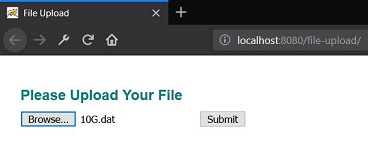
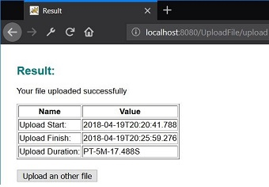
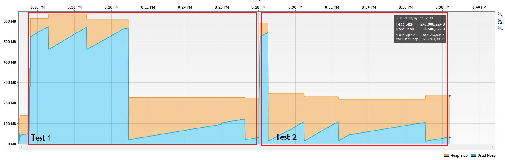

Current version of project uses JSP/Servlet to upload files. Servlet is designed so that it can upload big files ~10GB.

To test project you can run simple web application and upload a file in first page.

Result page will show detail about upload:

Uploaded file is saved in location specified in `web.xml` file:
Change it to proper directory if you use Linux OS.

    <context-param>
        <param-name>upload.location</param-name>
        <param-value>C:/Uploads</param-value>
    </context-param>

Folder should be created in your system before starting to upload.
    
This application uses maximum 600MB of RAM in manual tests for uploading a 10GB file, netbeans profiler is used to profile RAM usage:

See [Upload Servelt](https://github.com/AhmadHoghooghi/FileUpload/blob/master/file-upload-jsp-servlet/src/java/com/rhotiz/upload/controller/Upload.java) file for more informaion.

